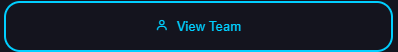

# 🎯 E-Sport Nexus
Un site vitrine moderne, réactif et multi-pages pour **Nexus Esports**, conçu pour mettre en avant l’univers de l’e-sport compétitif, les équipes et les tournois.

---

## 📝 Aperçu du projet
Ce site présente les principales fonctionnalités de Nexus Esports : les jeux populaires, les meilleures équipes et les tournois à venir.  
Il est organisé en **6 pages interconnectées** : Accueil, Tournois, Équipes, Jeux, Blog et Contact.

---

## 🚀 Travaux réalisés
- Conception des maquettes de chaque page sur **Figma**
- Intégration des maquettes en **HTML5 / CSS3**
- **Correction des problèmes d’accessibilité** à l’aide de Lighthouse et Axe Accessibility Linter
- **Optimisation des performances** et amélioration de l’interactivité (menus, boutons, effets au survol)

---

## 🛠️ Stack technique
- **HTML5 & CSS3**
- **Figma** (UI/UX)
- **Font Awesome** pour les icônes

---

## 🎨 Système de design
Le système vise à créer une interface moderne, dynamique et accessible, adaptée à l’univers de l’e-sport.

### Palette de couleurs

- **Info Color** : `#00CFFF` 🟦
- **Pink Color** : `#BF00FF` 🟪
- **Muted Color** : `#7c848e` ⬜

Utilisation typique :
```css
:root {
  --info-color: #00CFFF;
  --pink-color: #BF00FF;
  --muted-color: #7c848e;
}
```
---

## Typographies

- **H1** : `E-Sport Nexus`  
  Style : Titre principal, impactant.
- **H2** : `Upcoming Tournaments`  
  Style : Section, sous-titre.
- **H3** : `Cyber Championship 2025`  
  Style : Sous-section (article) ou élément important.
- **Font** : _**Nunito**_

Exemple d’utilisation :
```html
<h1>E-Sport Nexus</h1>
<h2>Upcoming Tournaments</h2>
<h3>Cyber Championship 2025</h3>
```

---

## Iconographie

- **Boxicons**  
  Tous les pictogrammes et icônes du projet utilisent la bibliothèque [Boxicons](https://boxicons.com/).
  ```html
  <i class='bx bx-trophy'></i>
  <i class='bx bx-calendar'></i>
  ```

---

## Boutons




Exemple HTML :
```html
 <button class="btn btn-gradient border-none" type="button">Start Competing</button>
```

---

## Résumé

Le système de design d’E-Sport Nexus est basé sur une palette de couleurs dynamique, une typographie impactante, des icônes Boxicons et des boutons dégradés pour une expérience utilisateur moderne et immersive.


